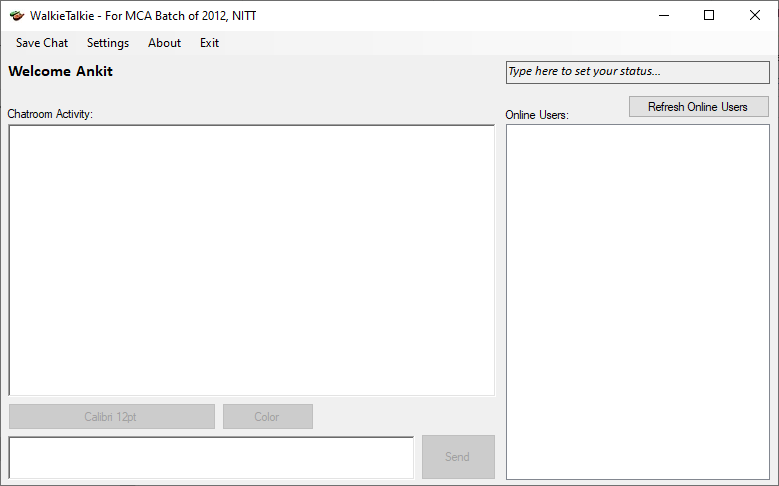

# Walkie Talkie
 

A peer-peer chat application that works on UDP. No centralized server needed. I created this as a POC during the computer networks course in my college.
This is an old project that I did in 2011-12. I'm releasing the source code under GPLv3.